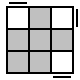
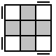
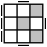
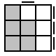
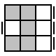

# OLL (Orient Last Layer)

Orient all pieces on the last layer. Master these 57 algorithms spread across 15 groups.

## All edges flipped correctly

### OLL 27

- R U R' U R U2 R'
- y' R' U2 R U R' U R

### OLL 26

- y2 R' U' R U' R' U2 R

### OLL 21

- R U R' U R U' R' U R U2 R'
- y F (R U R' U')3 F'

### OLL 22

- R U2 R2' U' R2 U' R2' U2 R

### OLL 23

- R2 D' R U2 R' D R U2 R
- (y2) R2 D R' U2 R D' R' U2 R'

### OLL 24

- r U R' U' r' F R F'
- (y' x') R U R' D R U' R' D'

### OLL 25

- y' F' r U R' U' r' F R
- l' U' L' U R U' L U x'

## No edges flipped correctly

### OLL 1

- R U2 R2 F R F' U2 R' F R F'

### OLL 2

- F (R U R' U') F' f (R U R' U') f'
- (y) (r U r') U2 R U2 R' U2 (r U' r')

### OLL 3

- (y') f (R U R' U') f' U' F (R U R' U') F'
- (y) r' R2 U R' U r U2 r' U R' r

### OLL 4

- f (R U R' U') f' U F (R U R' U') F'

### OLL 17

- R U R' U (R' F R F') U2 (R' F R F')

### OLL 18

- R U2 R2 F R F' U2 M' U R U' r'

### OLL 19

- r' R U (R U R' U') r R2' F R F'

## "P" shapes

### OLL 31

- (y2) R' U' F (U R U' R') F' R

### OLL 32

- R U B' U' R' U R B R'
- S (R U R' U') (R' F R f')

### OLL 43

- (y) R' U' F' U F R
- (y2) F' (U' L' U L) F

### OLL 44

- f (R U R' U') f'
- (y2) F (U R U' R') F'

## OLL 36

### OLL 36

- (y2) (L' U' L U') (L' U L U) (L F' L' F)
- (y) R U R2 F' U' F U R2 U2 R'

### OLL 38

- (y2) (R U R' U) (R U' R' U') (R' F R F')

## "L" shapes

### OLL 48

- F (R U R' U') (R U R' U') F'

### OLL 47

- F' (L' U' L U) (L' U' L U) F
- R' U' (R' F R F') (R' F R F') U R

### OLL 53

- (y2) r' U' (R U' R') (U R U' R') U2 r

### OLL 54

- r U R' (U R U' R') U R U2 r'

### OLL 49

- (y2) r U' r2 U r2 U r2 U' r

### OLL 50

- r' U r2 U' r2' U' r2 U r'

## "C" shapes

### OLL 34

- (R U R' U') B' (R' F R S) z'
- (R U R2 U') R' F R U R U' F'

### OLL 46

- R' U' (R' F R F') U R
