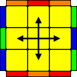
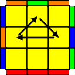
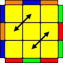

# PLL (Permute Last Layer)

## Permutations of Edges Only

### H

- M2' U M2' U2 M2' U M2'
- M2' U' M2' U2' M2' U' M2'
- R2' U2 R' U2 R2' U2' R2' U2 R' U2 R2'

### Ua

- (y2) R U' R U R U R U' R' U' R2
- R U R' U R' U' R2 U' R' U R' U R

### Ub

- (y2) M2 U' M U2 M' U' M2
- R' U R' U' R3 U' R' U R U R2

### Z

- (y) M2' U2 M U M2' U M2' U M
- M2' U2 M U' M2' U' M2' U' M

## Permutations of Corners Only

### Aa

- (x) R' U R' D2 R U' R' D2 R2 (x')
- l' U R' D2 R U' R' D2 R2 (x')
- (y) R' D' R U' R' D R U2 R' D' R U' R' D R

### Ab

- (y' x) R2 D2 R U R' D2 R U' R (x')
- (y') R' D' R U R' D R U R' D' R U2 R' D R

### E

- (y x') (R U' R' D) (R U R' D') (R U R' D) (R U' R' D') (x)
- R2 U R' U' (y) (R U R' U')2 R U R' (y') R U' R2'

## Permutations of Edges and Corners

### F

- (y) R' U' F' (R U R' U') R' F R2 (U' R' U') R U R' U R
- (y2) R' U2 R' d' R' F' R2 U' R' U R' F R U' F

### Ga

- (y) R2 U (R' U R' U') R U' R2 (D U' R' U) R D'

### Gb

- R' U' R U D' R2 U R' U R U' R U' R2 D

### Gc

- (y) R2 U' R U' R U R' U R2 D' U R U' R' D
- (y') R2 F2 R U2 R U2 R' F R U R' U' R' F R2

### Gd

- (y2) R U R' U' D R2 U' R U' R' U R' U R2 D'
- (y2) D' R U R' U' D R2 U' R U' R' U R' U R2

### Ja

- (y2) x R2' F R F' R U2 r' U r U2 x'

### Jb

- R U R' F' R U R' U' R' F R2 U' R' U'

### Na

- R U R' U R U R' F' R U R' U' R' F R2 U' R' U2 R U' R'
- F' R U R' U' R' F R2 F U' R' U' R U F' R'

### Nb

- (R' U R U' R') (F' U' F) (R U R') (F R' F') (R U' R)

### Ra

- (y') R U' R' U' R U R D R' U' R D' R' U2 R'
- (y') R U R' F' R U2 R' U2 R' F R U R U2 R'

### Rb

- R' U2 R U2 R' F (R U R' U') R' F' R2' U'
- R' U2 R' D' R U' R' D R U R U' R' U' R

### T

- R U R' F' R U R' U' R' F R2 U' R'
- R U R' U' R' F R2 U' R' U F' L' U L

### V

- R' U R' U' R D' R' D R3 U D' R2 U' R2' D R2
- R' U R' U' (y) R' F' R2 U' R' U R' F R F

### Y

- F R U' R' U' R U R' F' (R U R' U') (R' F R F')
